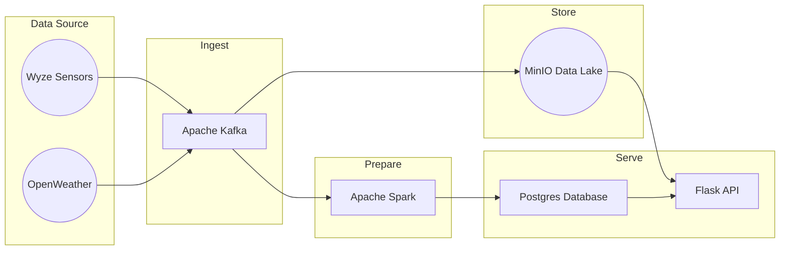

#  MyHome - Data Engineering Project

## Overview

This **Data Engineering Project** is an implementation of the data pipeline which consumes data for each Wyze Room Sensor associated to my Wyze Thermostat. The script allows for a variable of storage methods for the output data [AWS S3 Bucket, Azure Storage Blob, or PostgreSQL], if you do not want to store the data, you can choose 'Print' (default chose) and the results are displayed and not stored.

## License

Distributed under the MIT License. See [LICENSE](https://github.com/damklis/DataEngineeringProject/blob/master/LICENSE) for more information.

## Contact

Please feel free to contact me if you have any questions at: [LinkedIn](https://www.linkedin.com/in/johnsonjessm/), [Twitter](https://twitter.com/iamJessMJohnson), or by [Email](hello@JessMJohnson.com)
