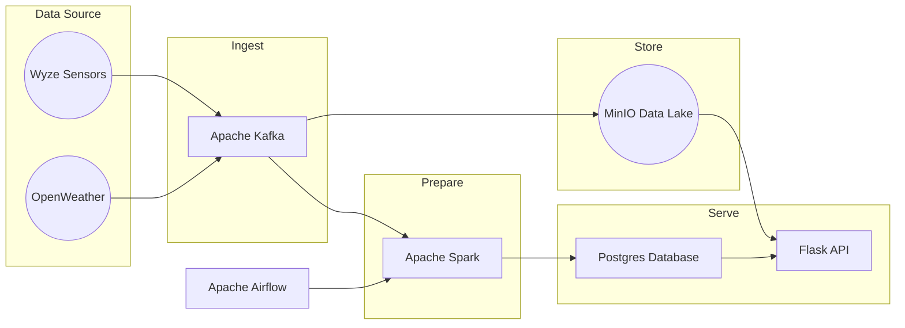

#  MyHome - Data Engineering Project

## Overview

The goal of this **Data Engineering** project is to simulate a real-time data engineering project using open-source technologies and provices a foundation for scaling up to handle larger volumes. that collects sensor data and processes it using Apache Kafka, Apache Spark, Apache Airflow, and PostgreSQL. The project involves using four Raspberry Pi devices and six Wyze Climate Sensors to collect temperature and humidity data every 5 minutes and publish it to a Kafka topic.

An Apache Airflow DAG is used to schedule the Python script that collects the sensor data and publishes it to Kafka. The DAG ensures that the script is run every 5 minutes, and provides monitoring and alerting capabilities in case of failures.

The data is then consumed by a Spark streaming application that processes the data and writes it to a PostgreSQL database. The Spark application is also run as a DAG in Apache Airflow, which schedules the application to run continuously and provides monitoring and alerting capabilities.

Additionally, the project incorporates Flask and SQLAlchemy to create a simple REST API that allows users to retrieve the sensor data from the database. This API is powered by a Flask application that retrieves the sensor data from the database and returns it in a JSON format.

Overall, this project provides an example of how different technologies can be integrated to create a real-world data engineering pipeline. It also showcases how Apache Airflow can be used to schedule and monitor the different components of the pipeline, ensuring that the data is collected and processed reliably and efficiently.

## License

Distributed under the MIT License. See [LICENSE](https://github.com/damklis/DataEngineeringProject/blob/master/LICENSE) for more information.

## Contact

Please feel free to contact me if you have any questions at: [LinkedIn](https://www.linkedin.com/in/johnsonjessm/), [Twitter](https://twitter.com/iamJessMJohnson), or by [Email](hello@JessMJohnson.com)
