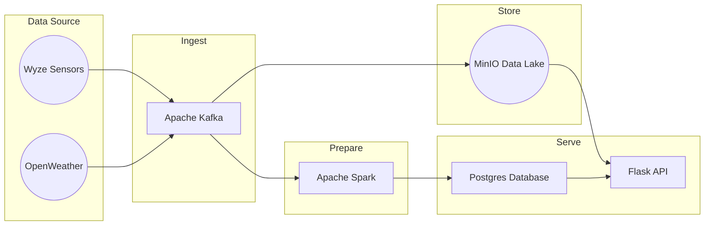

```mermaid 
flowchart LR
    subgraph "Data Source"
        DS1((Wyze Sensors))
        DS2((OpenWeather))
    end

    subgraph "Ingest"
        IS1[Apache Kafka]
    end

    subgraph "Store"
        DL1((MinIO Data Lake))
    end

    subgraph "Prepare"
        S1[Apache Spark]
    end

    subgraph "Serve"
        P1[Postgres Database]
        P2[Flask API]
    end

    DS1 --> IS1
    DS2 --> IS1
    IS1 --> DL1
    IS1 --> S1
    S1 --> P1
    DL1 --> P2
    P1 --> P2

```