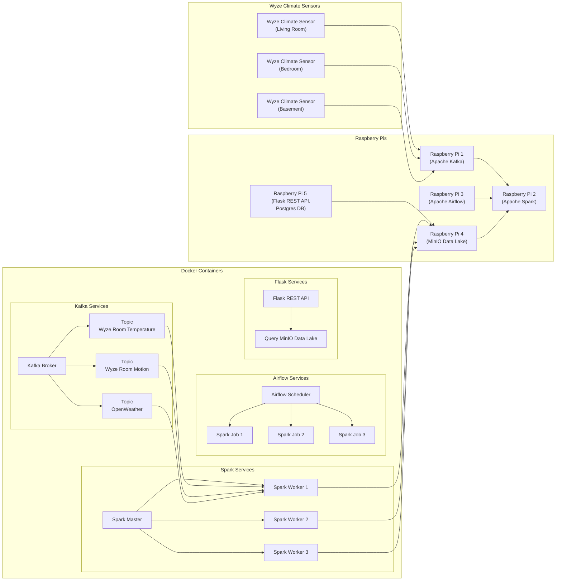

```mermaid 
graph LR
    subgraph Raspberry Pis
        RP1["Raspberry Pi 1 <br> (Apache Kafka)"] --> RP2["Raspberry Pi 2 <br> (Apache Spark)"]
        RP3["Raspberry Pi 3 <br> (Apache Airflow)"] --> RP2
        RP4["Raspberry Pi 4 <br> (MinIO Data Lake)"] --> RP2
        RP5["Raspberry Pi 5 <br> (Flask REST API, Postgres DB)"] --> RP4
    end
    subgraph Wyze Climate Sensors
        WCS1["Wyze Climate Sensor <br> (Living Room)"] --> RP1
        WCS2["Wyze Climate Sensor <br> (Bedroom)"] --> RP1
        WCS3["Wyze Climate Sensor <br> (Basement)"] --> RP1
    end
    subgraph Docker Containers
        subgraph Kafka Services
            KAF1["Kafka Broker"] --> KAF2["Topic <br> Wyze Room Temperature"]
            KAF1 --> KAF3["Topic <br> Wyze Room Motion"]
            KAF1 --> KAF4["Topic <br> OpenWeather"]
        end
        subgraph Spark Services
            SPR1["Spark Master"] --> SPR2["Spark Worker 1"]
            SPR1 --> SPR3["Spark Worker 2"]
            SPR1 --> SPR4["Spark Worker 3"]
        end
        subgraph Airflow Services
            AIF1["Airflow Scheduler"] --> AIF2["Spark Job 1"]
            AIF1 --> AIF3["Spark Job 2"]
            AIF1 --> AIF4["Spark Job 3"]
        end
        subgraph Flask Services
            FSK1["Flask REST API"] --> FSK2["Query MinIO Data Lake"]
        end
    end
    KAF2 --> SPR2
    KAF3 --> SPR2
    KAF4 --> SPR2
    SPR2 --> RP4
    SPR3 --> RP4
    SPR4 --> RP4

```