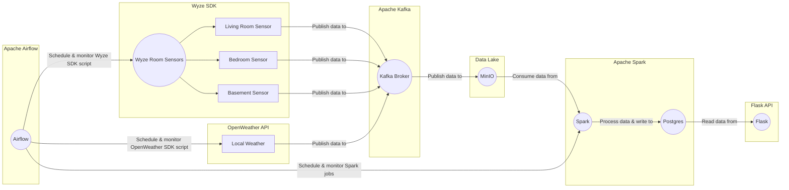

```mermaid 
flowchart LR
  subgraph "Wyze SDK"
    API1(("Wyze Room Sensors")) --> W1["Living Room Sensor"]
    API1 --> W2["Bedroom Sensor"]
    API1 --> W3["Basement Sensor"]
  end

  subgraph "OpenWeather API"
    O1["Local Weather"]
  end

  subgraph "Apache Kafka"
    K1((Kafka Broker))
    W1 -- Publish data to --> K1
    W2 -- Publish data to --> K1
    W3 -- Publish data to --> K1
    O1 -- Publish data to --> K1
  end
  
  subgraph "Data Lake"
    M1((MinIO))
    K1 -- Publish data to --> M1
  end

  subgraph "Apache Spark"
    S1((Spark))
    M1 -- Consume data from --> S1
    S1 -- Process data & write to --> P1((Postgres))
  end
  
  subgraph "Apache Airflow"
    A1((Airflow))
    A1 -- "Schedule & monitor Spark jobs" --> S1
    A1 -- Schedule & monitor Wyze SDK script --> API1
    A1 -- Schedule & monitor OpenWeather SDK script --> O1
  end

  subgraph "Flask API"
    F1((Flask))
    P1 -- Read data from --> F1
  end

```