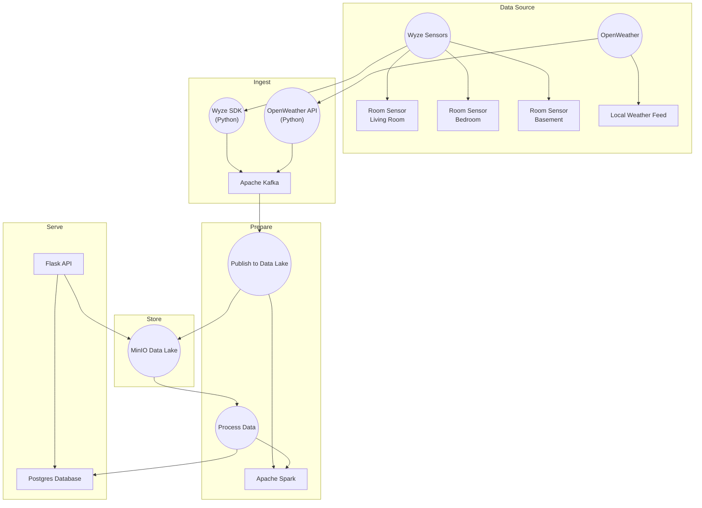

```mermaid 
flowchart TD
    subgraph "Data Source"
        DS1((Wyze Sensors)) --> RS1[Room Sensor <br> Living Room]
        DS1 --> RS2[Room Sensor <br> Bedroom]
        DS1 --> RS3[Room Sensor <br> Basement]
        DS2((OpenWeather)) --> F1[Local Weather Feed]
    end

    subgraph "Ingest"
        I1(("Wyze SDK <br> (Python)")) --> IS1[Apache Kafka]
        I2(("OpenWeather API <br> (Python)")) -->IS1
    end

    subgraph "Store"
        DL1((MinIO Data Lake))
    end

    subgraph "Prepare"
        J1(("Publish to Data Lake")) --> S1[Apache Spark]
        J2(("Process Data")) --> S1
    end

    subgraph "Serve"
        P1[Postgres Database]
        P2[Flask API]
    end

    DS1 --> I1
    DS2 --> I2
    IS1 --> J1
    J1 --> DL1
    DL1 --> J2
    J2 --> P1
    P2 --> P1
    P2 --> DL1


```

    B((Apache Airflow))
